# My collection of Computer Vision projects

> by 沅
>
> 2018-07-23
>
> This is a collection of Computer Vision projects.
>
> I use CImg and some opencv tool to  build all the projects with C++.

## 1. Get started with CImg

Learning to use CImg libray to processing image.

## 2. Canny Algorithm 

Canny is an algorithm for extracting edge from an image.

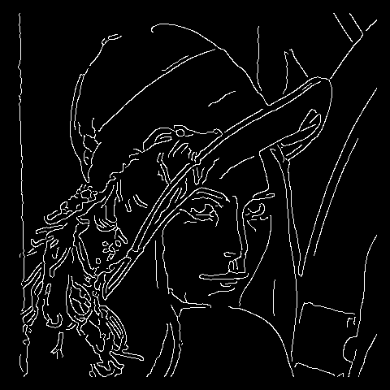

## 3. Line&Circle Detector

Make use of hough transform to detect lines or circles in an image.

|   Line detection result    |    Circle detection result     |
| :------------------------: | :----------------------------: |
| 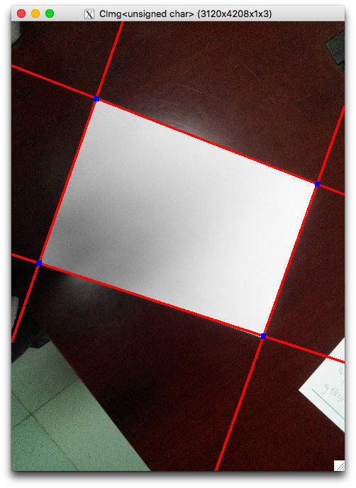 | 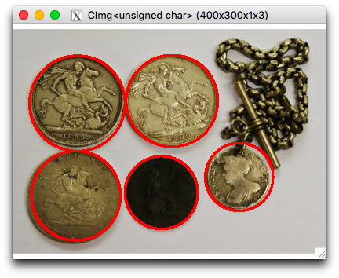 |

## 4. A4 Warping

According to the line detector from 3 above, I make this to warping the A4 from image for A4 correction.

| origin |  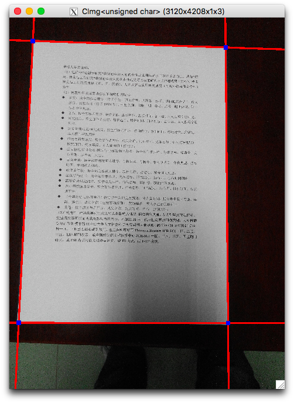  |
| :----: | :----------------------------: |
| warped |  |

## 5. Face-Morphing

I make use of the dlib face pose recognition library to mark the human face pose, then match two images' face pose to make warping. 

| girl               | merged             | baby                 | GIF                                  |
| ------------------ | ------------------ | -------------------- | ------------------------------------ |
| 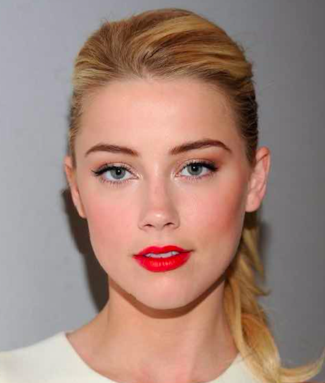 | 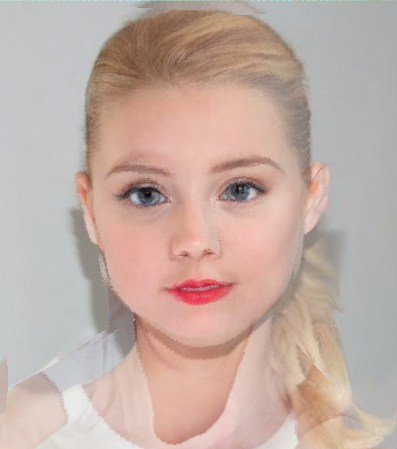 | 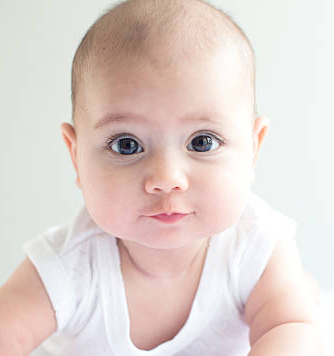 | 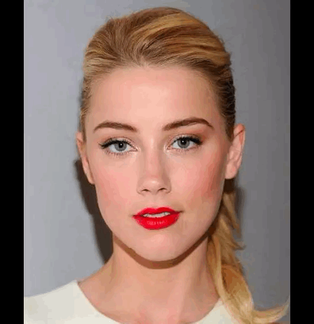 |

## 6. Stitching

I use opencv feature extractor to extract sift feature from image, and implement RANSAC algorithm to match the feature point. Finally, I stitching image together.

| 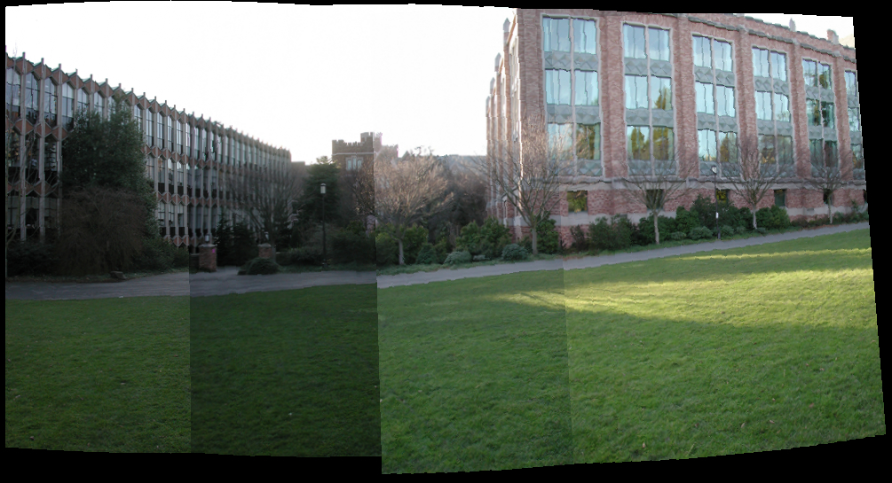   |
| ---------------------------------- |
| 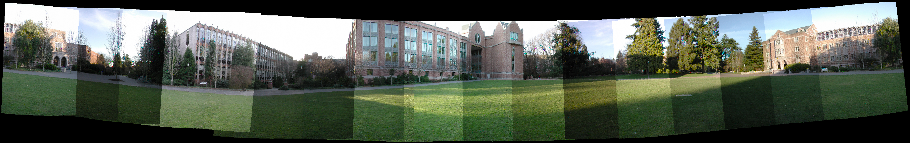 |

## 7. Threshold Segmentation

Make a comparision of Global Threshold Segmentation and Ostu Segmentation.

| Global Threshold   | Ostu                       |
| ------------------ | -------------------------- |
| 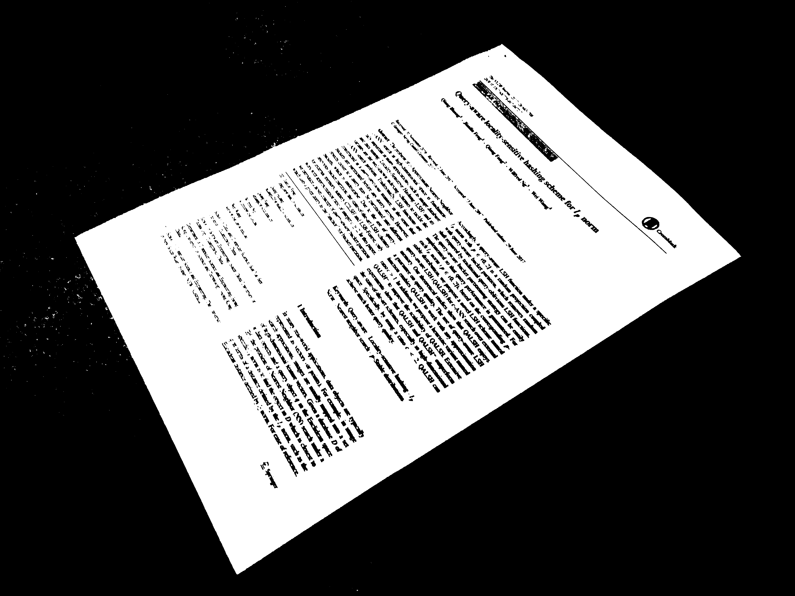 | 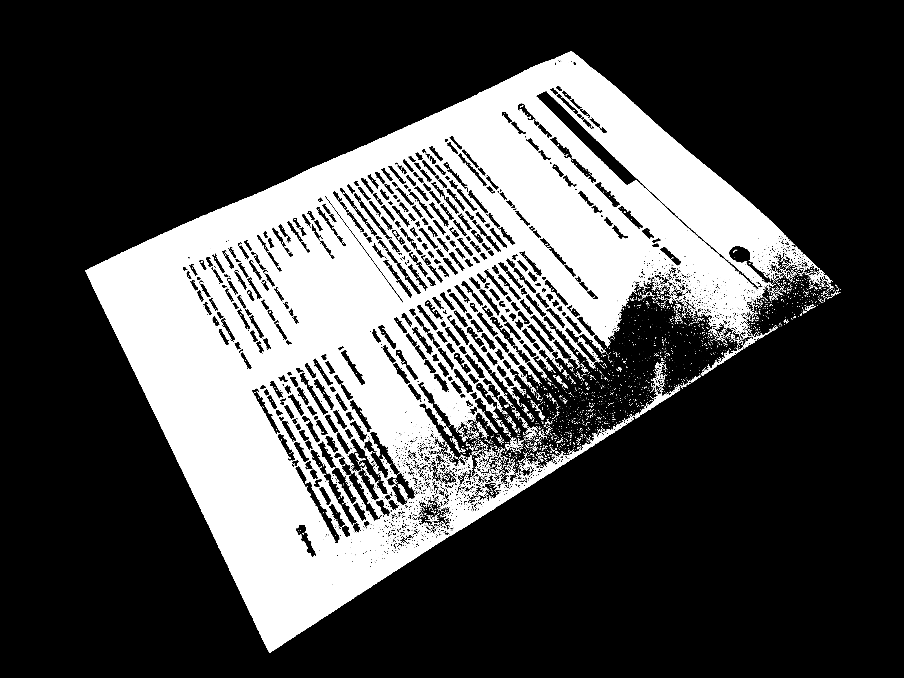 |

## 8. A4 Handwriting Number Recognizer

I train opencv svm classifier on MNIST and implement it on the A4 handwriting number recognition.

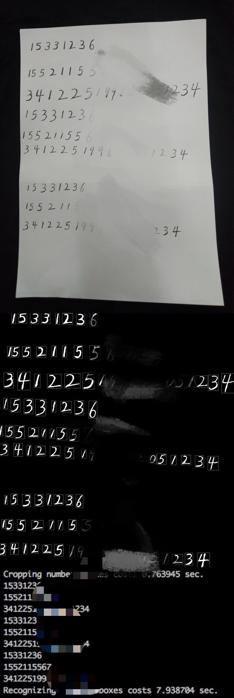

